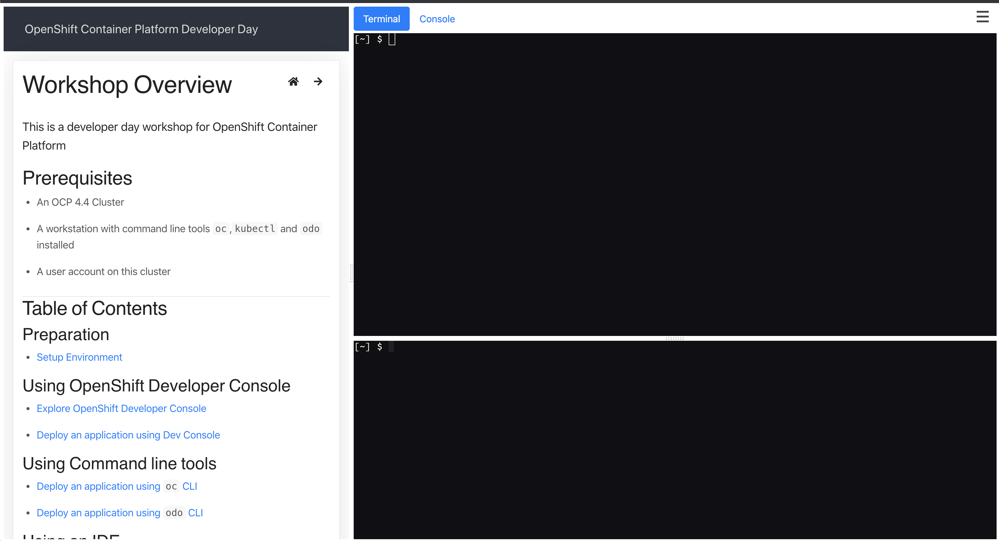

OpenShift Container Platform Developer Day - Homeroom 
=====================

This workshop uses the [OpenShift Container Platform Developer Day](https://github.com/RedHatWorkshops/openshiftv4-devday) lab content to deploy a Homeroom lab. 




## OpenShift prerequisites 
Install OpenShift Pipelines 
  * [Installing OpenShift Pipelines](https://docs.openshift.com/container-platform/4.4/pipelines/installing-pipelines.html)
* Install CodeReady WorkSpaces  
  * Install CodeReady Workspaces using the Operator

**prerequisites for CRW Ansible role**
* install ansible
* install openshift cli
* install the pip dependancies 
```
pip install kubernetes
pip install openshift
```
**Login to OpenShift**

**Create Shortcut to ansible role**
```
ln -s $pwd/.workshop/scripts/crw/code-ready/  /etc/ansible/roles/
```

**Create ansible file for deployment.**
```
cat crw.yml 
- hosts: localhost
  become: yes
  vars:
    route_subdomain: apps.ocp4.example.com
    users: 5
    workshop_che_user_password: openshift
  roles:
    - code-ready

```

**To Create  CRW deployment**
```
ansible-playbook crw.yml -e  "delete_deployment=true"
```

**Delete CRW deployment**
```
ansible-playbook crw.yml -e  "delete_deployment=true"
```

## openshiftv4-devday-homeroom deployment Instructions
**Clone openshiftv4-devday-homeroom repo**
```
git clone https://github.com/tosin2013/openshiftv4-devday-homeroom.git
```

**cd into  openshiftv4-devday-homeroom folder**
```
cd openshiftv4-devday-homeroom
```

**run the script below to update the content from [openshiftv4-devday](https://github.com/RedHatWorkshops/openshiftv4-devday) repo**
```
.workshop/scripts/update-content.sh 
```


## How to test on OpenShift

**Create project**
```
oc new-project workshop
```

**Create personal workshop deployment**
```
.workshop/scripts/deploy-personal.sh --settings=develop
```

**Build workshop deployment**
```
.workshop/scripts/build-workshop.sh
```

**Access deployment**
```
oc get route/openshiftv4-devday
```

**Access the workshop**
```
username: workshop 
password: workshop
```


 mkdir $HOME/.local && cd $HOME/.local &&  curl -OL https://github.com/tektoncd/cli/releases/download/v0.10.0/tkn_0.10.0_Linux_x86_64.tar.gz && tar xvzf tkn_0.10.0_Linux_x86_64.tar.gz --strip-components 1 -C $HOME/.local 